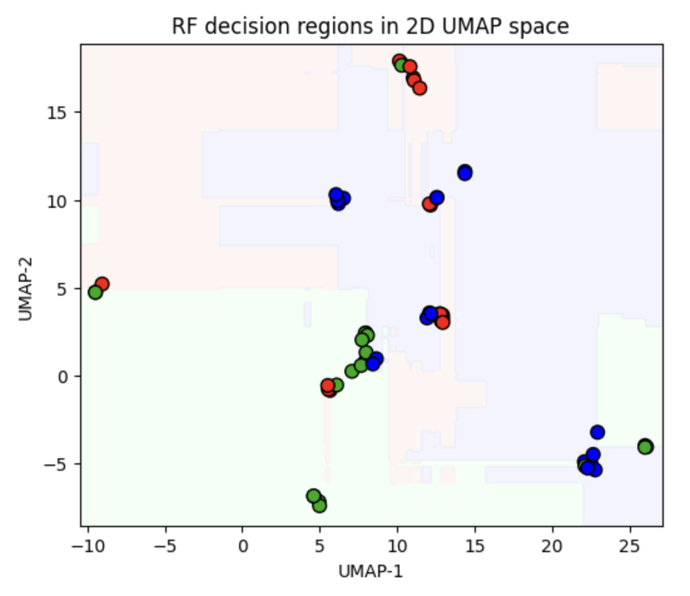
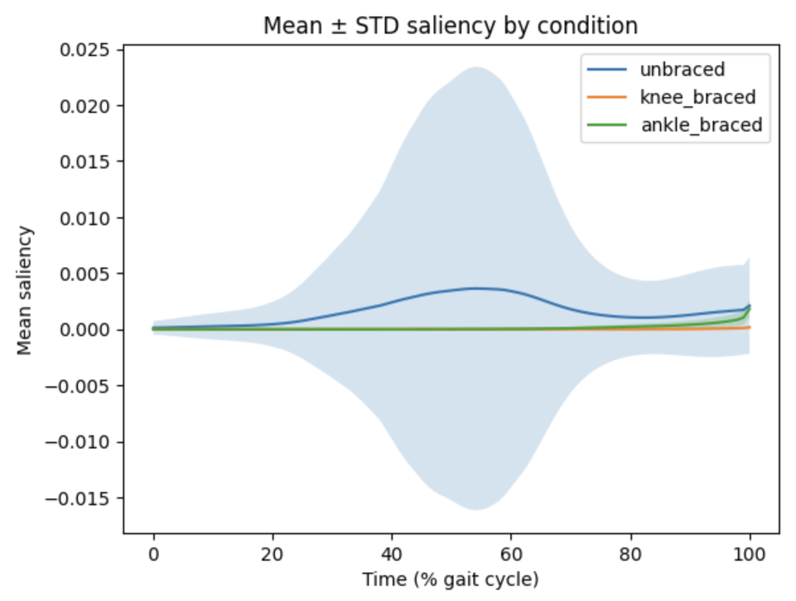
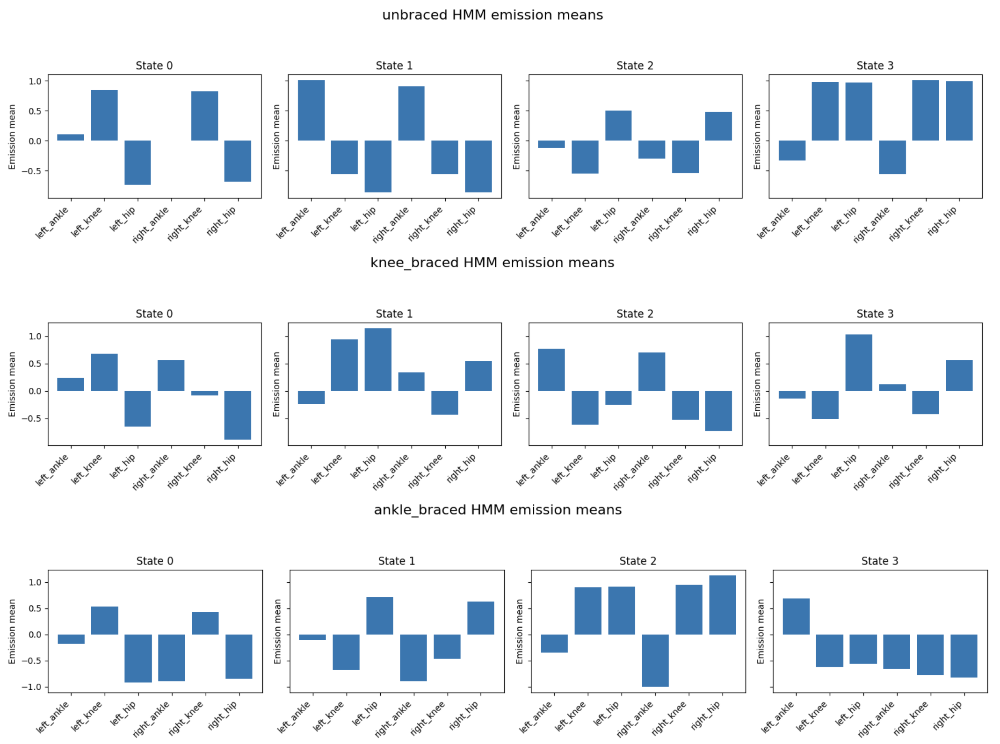

# Multivariate Gait Analysis under Bracing Conditions

[](LICENSE)
[](https://www.python.org/)
[](https://www.tensorflow.org/)
[](https://scikit-learn.org/)
[](https://colab.research.google.com/github/<your-username>/<repo-name>/blob/main/multivariate_gait_analysis.ipynb)

*Classifying joint-angle gait dynamics into three bracing conditions (unbraced, knee-braced, ankle-braced) with a progression of models from classical machine learning through temporal and graph deep learning, with interpretability and honest subject-level generalization testing at every step.*

## At a glance

Six lower-limb joint angles per gait cycle are used to classify which brace, if any, a subject is wearing. Hand-engineered features with a Random Forest already solve the task at 1.000 leave-one-subject-out accuracy, so the temporal (HMM, LSTM) and graph (ST-GCN) models serve mainly to interpret the underlying biomechanics rather than to beat that baseline. Every model is validated at the subject level, and a higher-capacity ST-GCN is reported honestly as an overfitting failure on this small dataset rather than omitted.

## Table of contents

- [Problem](#problem)
- [Data](#data)
- [Results](#results)
- [Interpretability](#interpretability)
- [Figures](#figures)
- [Repository structure](#repository-structure)
- [Reproducibility](#reproducibility)
- [Installation](#installation)
- [Usage](#usage)
- [Limitations and future work](#limitations-and-future-work)
- [Citation](#citation)
- [License](#license)

## Problem

Each sample is one full gait cycle, normalized to 101 time points, described by six joint-angle channels: left and right ankle, knee, and hip. The task is to classify the bracing condition applied during that cycle. The dataset is small and balanced, with 300 cycles evenly split across the three conditions and drawn from 10 subjects, which makes subject-level generalization the real test rather than raw cycle-level accuracy.

## Data

The raw input is a long-format table with one row per (subject, condition, replication, leg, joint, time) and a single `angle` value, totalling 181,800 rows. The pipeline pivots this into a tensor of shape (300, 101, 6), z-normalizes each joint channel, and applies two smoothing variants (a length-5 moving average and a third-order Butterworth low-pass at 2 Hz). Velocity and acceleration channels are derived by finite differencing. See `data/README.md` for the expected schema and file path. The CSV is not committed to the repository.

## Results

The modeling arc moves deliberately from simple to complex, using each model as much to interpret the biomechanics as to push accuracy. All numbers below come from the committed notebook run with a fixed seed of 42.

| Model | Input | Stratified 5-fold CV | Generalization |
|---|---|---|---|
| Random Forest | 50 static features (48 engineered + 2 PCA) | 0.997 (MA), 1.000 (Butterworth) | LOSO 1.000 (MA), 0.997 (Butterworth) |
| Gaussian HMM | smoothed sequences, 4 states per class | 1.000 | LOSO 0.983; 2-subject holdout 0.974 |
| LSTM | smoothed sequences | 0.993 ± 0.008 | Fresh hold-out 0.933 |
| LSTM + attention | smoothed sequences | near-perfect on split | interpretable attention over the cycle |
| ST-GCN | anatomical skeleton graph (angle, plus velocity/acceleration in trial 2) | 0.61 then 0.57, both ± 0.18 | test ~0.57, unbraced class collapses |

**Random Forest.** Hand-engineered per-channel features (peak and trough values and their timing, three window means over early, mid, and late stance, and a mid-stance velocity mean, giving 6 channels times 8 features) plus two PCA axes make up the 50 features. This alone essentially solves the task, reaching a perfect leave-one-subject-out score. Feature importances point squarely at right-ankle and right-knee peak and velocity, matching the exploratory analysis.

**Hidden Markov Model.** A Gaussian HMM is fit per class and cycles are labelled by maximum log-likelihood. Beyond strong accuracy (0.983 LOSO), the learned transition matrices and emission means are interpreted directly: the knee brace produces a near-absorbing mid-stance state (a self-transition of 1.0), and the ankle brace prolongs a flattened push-off state. Viterbi decoding quantifies how each condition redistributes dwell time across gait phases, and all five LOSO errors turn out to be unbraced-versus-ankle-braced confusions.

**LSTM.** A recurrent model reaches 0.993 in cross-validation but only 0.933 on a fresh hold-out, and the interpretability analysis helps explain the gap. Averaging gradient saliency per condition across the cycle shows a clear positive cue only for the unbraced class, a mid-stance saliency hump around 50% of the cycle, while the braced conditions produce almost flat saliency everywhere. The model therefore recognizes normal gait by its mid-stance signature and tends to label a cycle as braced when that signature is absent, rather than learning a distinct positive pattern for each brace. An attention-augmented variant was also trained, and its attention weights concentrate on the same discriminative windows, corroborating this reading.

**ST-GCN.** A spatio-temporal graph convolutional network encodes the anatomical skeleton (intra-leg ankle-knee-hip chains plus cross-side hip, knee, and ankle links) and mixes information across joints per frame before temporal convolution. Despite two trials, including added velocity and acceleration channels, residual blocks, and early stopping, it overfits badly on this small dataset (CV around 0.57 to 0.61 with high variance) and collapses the unbraced class to zero recall, even though its probability outputs retain a macro ROC-AUC near 0.83. This is reported as an honest negative result and a data-size limitation rather than hidden.

**Interim visualization.** A UMAP projection of the engineered features shows three clean clusters. Overlaying model predictions on that projection makes the failure modes visible: Random Forest and LSTM recover all three clusters, while the HMM overlay never carves out a distinct knee-braced region in that embedding.

## Interpretability

Interpretability is a first-class concern throughout: Random Forest feature importances, HMM transition and emission analysis with Viterbi dwell-time decomposition, LSTM gradient saliency maps, a custom attention layer, ST-GCN input-gradient node saliency, and UMAP decision-region overlays.

## Figures

Three plots in `figures/` summarize the analysis for a reader skimming the repository.

| | |
|---|---|
|  |  |
| **RF decision regions in UMAP space.** The shaded areas are the Random Forest's decision regions projected to 2D; the held-out test cycles are overlaid to inspect the learned boundaries and check for leakage. | **LSTM saliency by condition.** Mean +/- STD gradient saliency across the cycle. The unbraced class shows a clear mid-stance hump (~50%), while the braced classes stay near zero, so the model keys on normal gait's mid-stance signature and treats its absence as braced. |



**HMM emission means per condition.** Each condition's four-state HMM recovers gait sub-phases (heel-strike, mid-stance, push-off, swing), and the bracing conditions modulate the hip and ankle channels: the knee brace lifts hip flexion in its mid-stance state, and the ankle brace flattens the ankle channels through the late-stance state.

## Repository structure

```
.
├── multivariate_gait_analysis.ipynb       # main analysis notebook
├── data/
│   └── README.md                          # expected schema and path; CSV not committed
├── figures/                               # exported plots referenced above
├── requirements.txt
├── .gitignore
├── LICENSE
└── README.md
```

## Reproducibility

Developed in Google Colab on Python 3.11. A single global seed of 42 is set for Python, NumPy, and TensorFlow at the top of the notebook, and every scikit-learn split and estimator is passed the same seed, so the reported numbers are reproducible on a rerun. The notebook loads its data by mounting Google Drive; to run locally, remove the `google.colab` cell and point the data path at your file (see `data/README.md`). A GPU runtime speeds up the LSTM and ST-GCN training but is not required.

## Installation

```bash
git clone https://github.com/<your-username>/<repo-name>.git
cd <repo-name>
python -m venv .venv && source .venv/bin/activate
pip install -r requirements.txt
```

## Usage

```bash
jupyter lab multivariate_gait_analysis.ipynb
```

Run the cells in order. The notebook handles loading and reshaping, smoothing, exploratory analysis and statistical tests, then the Random Forest, HMM, LSTM, attention-LSTM, UMAP visualization, and the two ST-GCN trials, each with its own interpretability section.

## Limitations and future work

The dataset is the main constraint: 300 cycles from 10 subjects is enough for classical models but too small for the high-capacity ST-GCN, which memorizes the training split and fails to generalize. The most valuable next step is simply more subjects, which would give the graph model a fair test. Deep models here are validated with a single stratified hold-out rather than full leave-one-subject-out, so extending LOSO to the LSTM and ST-GCN would make their generalization claims as rigorous as the Random Forest and HMM ones. The ST-GCN's unbraced-class collapse also points to class-aware training (class weights, focal loss, or threshold tuning informed by its healthy ROC-AUC of 0.83) as a concrete fix worth trying before concluding the architecture is unsuited. Finally, external validation on a separate gait dataset would test whether the learned bracing signatures transfer beyond this cohort.

## Citation

If you use this work, please cite it:

```bibtex
@misc{gait_bracing_classification,
  author       = {Sivakumar, Yogarajan},
  title        = {Multivariate Gait Analysis under Bracing Conditions:
                  Machine Learning and Deep Learning Approaches},
  year         = {2025},
  howpublished = {\url{https://github.com/<your-username>/<repo-name>}}
}
```

Please also cite the original gait dataset once its source is added in `data/README.md`.

## License

Released under the MIT License. See [LICENSE](LICENSE).

## Author

Yogarajan Sivakumar. Research focused on interpretable and uncertainty-aware machine learning for clinical and biomedical applications.
